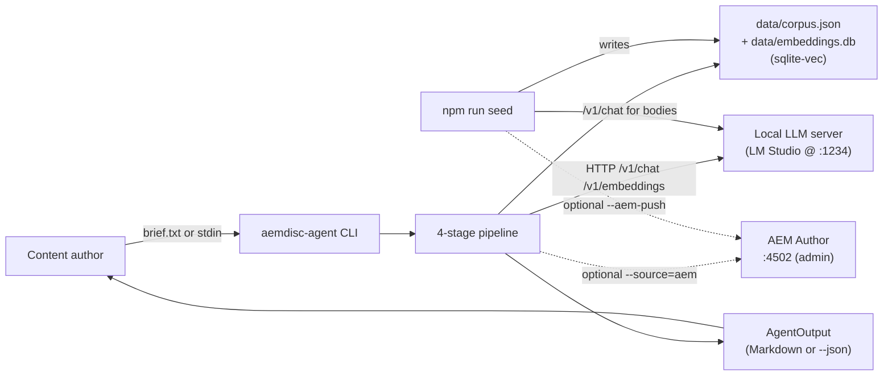
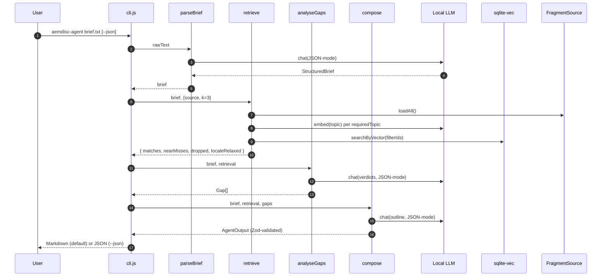
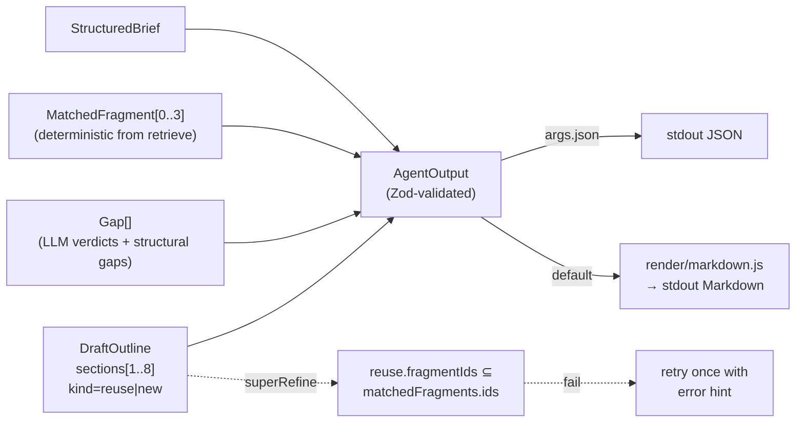
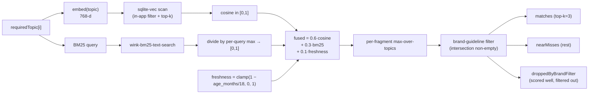

# Architecture

End-to-end design of the **AEM Content Discovery Agent**: a Node 22 CLI that
turns a free-form content brief into a strict, schema-validated
`AgentOutput` — top-3 reusable Content Fragments, a gap analysis, and a draft
page outline — using a local content corpus and a local LLM.

## Table of contents

- [Purpose](#purpose)
- [System context](#system-context)
- [Monorepo layout](#monorepo-layout)
- [Runtime pipeline](#runtime-pipeline)
  - [parseBrief](#1-parsebrief)
  - [retrieve](#2-retrieve)
  - [analyseGaps](#3-analysegaps)
  - [compose](#4-compose)
- [Seeding flow](#seeding-flow)
- [Retrieval and scoring](#retrieval-and-scoring)
- [LLM stack](#llm-stack)
- [Schema validation](#schema-validation)
- [Optional AEM source mode](#optional-aem-source-mode)
- [Prompt logging](#prompt-logging)
- [Evaluation harness](#evaluation-harness)
- [Why agentic](#why-agentic)
- [Example: input and output](#example-input-and-output)
- [Where to look next](#where-to-look-next)

## Purpose

A content author hands the agent a paragraph describing the page they want to
build. The agent must answer three questions in one pass:

1. **What can I reuse?** The top-3 most relevant Content Fragments from the
   corpus, with a per-match score and a short reason.
2. **What's missing?** Topics the brief requires that the corpus does not
   cover (or covers only partially), each with a concrete next step.
3. **How should I assemble the page?** A draft outline whose sections are
   strictly either `reuse` (citing fragment ids) or `new` (with a sourcing
   hint).

The output is a single Zod-validated `AgentOutput` object; the Markdown
renderer is a view over that object, never a parallel implementation.

## System context



The CLI is the only entry point at runtime. The seeder is a separate npm
script that produces the corpus offline; its outputs (`data/corpus.json`,
`data/embeddings.db`) are committed so a grader can run the agent without
re-seeding.

## Monorepo layout

Three npm workspaces wired through the root `package.json`:

```
.
├── shared/                # @aemdisc/shared — schemas, LLM, AEM, retrieval primitives
│   └── src/{aem,config,llm,retrieve,schema,sources}/
├── content-seeder/        # `npm run seed` — writes data/corpus.json (+ optional AEM push)
│   └── src/{generate,topics,templates,embeddings,aem-push}.js
├── discovery-agent/       # `npm run agent` — CLI + 4-stage pipeline + Markdown renderer
│   └── src/{cli.js, pipeline/, render/markdown.js}
├── eval/                  # `npm run eval` — F1 harness over hand-labelled briefs
│   ├── briefs/            # 8 briefs spanning en-gb / en-us / fr-fr / de-de
│   ├── expectations/      # gold fragment ids + gap topics
│   └── run.js
├── config/models.json     # single source of truth for chat/embedding model selection
├── data/
│   ├── corpus.json        # canonical content corpus (committed)
│   └── embeddings.db      # sqlite-vec 768-d vectors (committed)
├── aemcontentdisc/        # AEM project: CF Model XML + Maven build (optional)
├── docs/                  # architecture deep-dive, sample run, prompt-log
├── why.md                 # append-only decision log
└── prompt-log.md          # auto-appended runtime chat transcript
```

The split exists because the seeder and agent have different lifecycles
(one-shot vs many-shot) and different transitive dependencies (the seeder
needs `@faker-js/faker`; the agent does not). `shared/` keeps the schemas,
OpenAI-compatible LM Studio client, retrieval primitives, and the
`FragmentSource` abstraction in one place so they cannot drift.

## Runtime pipeline



Each stage lives in `discovery-agent/src/pipeline/`. LLM calls in
`analyseGaps` and `compose` are retried **once** on `OllamaJsonParseError`
or `ZodError` with the previous error message glued onto the system
prompt; a second failure throws and the CLI exits with code `1`.
`parseBrief` retries **twice** on shape errors, each retry tightening
the system prompt with the prior validation message before giving up.

### 1. parseBrief

Source: `discovery-agent/src/pipeline/parseBrief.js`.

- Runs `chat({ system, user, json: true })` against the model configured for
  the `parseBrief` stage (`getChatModel("parseBrief")`).
- Locks the brand-guideline vocabulary to a fixed enum in the system prompt
  so the model cannot invent new guidelines.
- Pre-detects locale from any `/en-gb/`, `/fr-fr/`, `/de-de/` path in the
  input and forces it onto the result; mismatches are recorded in
  `brief.uncertain[]`.
- Output: `StructuredBrief` — `{ audience, locale, tone, brandGuidelines[],
  requiredTopics[], pathHint, uncertain? }`.

### 2. retrieve

Source: `discovery-agent/src/pipeline/retrieve.js`.

- Loads candidate fragments via the chosen `FragmentSource`
  (`JsonFragmentSource` for `--source=json`, `AemFragmentSource` for
  `--source=aem`).
- Applies a **locale ladder**: exact `brief.locale` → language prefix
  (`en-*` for an `en-gb` brief) → all locales. Each fallback sets
  `retrievalResult.localeRelaxed`, which `analyseGaps` later surfaces as a
  structural gap.
- For each `requiredTopic`: embed the topic, run a `sqlite-vec` cosine
  scan (the SQL orders all stored vectors by distance; locale-id
  filtering and the top-k cut are applied in-app as the result set is
  read), run a `wink-bm25-text-search` query against the same locale
  set, divide each BM25 score by the per-query max to scale to `[0,1]`,
  then fuse.
- Keep each fragment's best per-topic score (max-over-topics).
- Split results into `matches` (top-k, default 3), `nearMisses` (the rest
  of the survivors), and `droppedByBrandFilter` (high-scoring fragments
  that share no `brandGuidelines` with the brief). Dropped fragments stay
  visible to `analyseGaps` so the agent can report "candidates existed but
  were filtered out".
- `match.reason` is **deterministically generated** from the score
  breakdown by `buildReason()` — never LLM-written. This keeps the top
  block of every output stable and auditable.

### 3. analyseGaps

Source: `discovery-agent/src/pipeline/analyseGaps.js`.

Two passes:

1. **LLM judge.** One chat call asks the model to verdict each
   `requiredTopic` as `none | partial` against the candidate pool
   (`matches ∪ nearMisses ∪ droppedByBrandFilter`). Schema:
   `{ verdicts: TopicVerdict[] }`. Same retry-once-with-error-hint policy.
   Verdicts are sanitised afterwards (`partialMatches` is intersected with
   the candidate pool; a `partial` verdict with no surviving matches is
   downgraded to `none`).
2. **Structural gaps** (deterministic, appended without an LLM call):
   - `Locale-appropriate content for {locale}` when
     `retrieval.localeRelaxed` is truthy.
   - `Brand guideline coverage: {guideline}` for every required brand
     voice that no top match applies.

`suggestedAction` is templated (`Write a 200-word {locale} {category}
fragment …`) so every gap has a concrete next step regardless of model
quality.

### 4. compose

Source: `discovery-agent/src/pipeline/compose.js`.

- Builds the user payload from `{ brief, matchedFragments, gaps }`, each
  matched fragment summarised to 200 chars to keep the prompt small.
- Asks the model for a `DraftOutline` with 1..8 sections, each strictly
  tagged `kind: "reuse"` (with `fragmentIds[≥1]` referencing only matched
  ids) or `kind: "new"` (with `sourcingHint`).
- The Zod schema is wrapped in a `superRefine` that rejects any `reuse`
  section whose `fragmentIds` are not in `matchedFragments` — preventing
  the model from hallucinating fragment ids.
- The final `AgentOutput.parse({ schemaVersion: "1.0", brief,
  matchedFragments, gaps, draftOutline })` is the only authoritative
  source of the agent's output shape.
- `pathHint` is overwritten from the brief if present, so the outline
  always agrees with the brief's URL intent.

**Output composition:**



The `superRefine` guard is the bridge that prevents the model from
inventing fragment ids during composition; the Markdown renderer is a
pure view over the validated object.

## Seeding flow

```mermaid
flowchart TD
    Args["CLI flags<br/>--seed --count --locales --variation --aem-push --reset --dry-run"] --> Plan["Plan topics<br/>(deterministic per --seed)"]
    Plan --> Body["For each fragment:<br/>chat(category template)"]
    Body --> Validate["Zod-validate Fragment"]
    Validate --> Corpus["Write data/corpus.json"]
    Validate --> Embed["embed(content)"]
    Embed --> DB["Write data/embeddings.db<br/>(sqlite-vec, 768-d)"]
    Validate -.--aem-push.-> Sling["AEM Sling POST<br/>/content/dam/aemcontentdisc/&lt;locale&gt;/&lt;id&gt;"]
```

The seeder is the **sole writer** to `data/embeddings.db`; the agent only
reads. Re-embed cost is therefore paid once per `--seed`, not per agent
invocation. The locked canonical corpus is produced by
`npm run seed -- --seed=20260626 --count=40` and is committed.

## Retrieval and scoring



**Locale ladder.** Before scoring, the candidate set is restricted by the
locale ladder. If the exact-locale subset yields no candidates the rung
relaxes to the language prefix (`en-*`), then to all locales; every
relaxation is recorded as a structural gap.

**Why these weights.** Heavy semantic weighting (0.6) suits the free-form
"describe my page" briefs the agent ingests, while BM25 keeps the
retriever honest on exact-match signals (locale codes, brand tags, proper
nouns). Freshness gets a small thumb-on-the-scale so equally relevant
fragments are ranked recent-first.

## LLM stack

A single thin client (`shared/src/llm/`) wraps the local LM Studio server
over its OpenAI-compatible HTTP API:

- `chat.js` — posts to `POST {host}/v1/chat/completions`. Strips a leading
  `<think>…</think>` block as a safety net, then `JSON.parse`s the reply
  when `json: true`.
- `embed.js` — posts to `POST {host}/v1/embeddings`, returns the 768-d
  vector directly.
- `ollama.js` — host resolution (`OLLAMA_HOST` env, default
  `http://localhost:1234`, which is LM Studio's default port), timeout
  (`CHAT_TIMEOUT_MS`, default 120 s), retries on `OllamaUnavailableError` /
  `OllamaServerError`. The file name and `Ollama*` identifiers are
  preserved from an earlier Ollama-backed implementation; today the
  transport targets LM Studio. Other typed errors
  (`OllamaJsonParseError`, `OllamaModelNotFoundError`,
  `OllamaContextOverflowError`, `OllamaTimeoutError`,
  `OllamaInvariantError`) propagate to callers so each pipeline stage can
  decide whether to re-prompt or abort.
- `models.js` — `getChatModel(stage)` / `getEmbeddingModel()` read
  `config/models.json`; per-stage overrides (`parseBrief`, `analyseGaps`,
  `compose`, `seeder`) fall back to `chat.default`. Changing models is a
  config edit, not a code change.

Defaults in `config/models.json` (see `why.md` for the picks):

| Stage | Model |
|---|---|
| chat.default / parseBrief / analyseGaps / compose / seeder | `google/gemma-4-e4b` |
| embedding.default | `embeddinggemma-300m` |

## Schema validation

All cross-stage contracts live in `shared/src/schema/`:

- `Fragment` — what the seeder writes and the agent consumes.
- `StructuredBrief` — the `parseBrief` output.
- `MatchedFragment` — `{ id, path, score, reason }`.
- `Gap` — `{ topic, coverage, description, partialMatches, suggestedAction }`.
- `DraftOutline` — strictly typed `reuse` vs `new` sections; `reuse`
  sections are cross-validated against the matched-fragment id set via
  `superRefine`.
- `AgentOutput` — the agent's only contract with its caller; carries
  `schemaVersion: "1.0"`.

Every LLM-generated object is parsed through its Zod schema immediately
on receipt. A `ZodError` triggers one retry (with the validation message
appended to the system prompt) before the stage gives up. This is why a
malformed model reply cannot corrupt downstream stages.

## Optional AEM source mode

The `FragmentSource` interface (`shared/src/sources/`) has two
implementations:

- `JsonFragmentSource(path)` — default; reads and validates
  `data/corpus.json`.
- `AemFragmentSource(client)` — calls `GET
  /content/dam/aemcontentdisc/<locale>.json` via the AEM client
  (`shared/src/aem/`), maps the Sling JSON into the `Fragment` shape, and
  serves the same `loadAll()` contract.

`--source=aem` is the only switch that flips between them. The pipeline
above the source is identical, which is why the AEM path is exercised by
the same tests as the JSON path. The decision log entry "JSON-primary,
AEM-optional" in `why.md` explains why JSON wins as the default.

## Prompt logging

`shared/src/llm/prompt-log.js` appends a Markdown entry to
`prompt-log.md` for **every** chat call — success or failure — with the
model, system + user heads, response (or error class + message), and
duration. `PROMPT_LOG_PATH` overrides the location. Together with `why.md`
and the typed error taxonomy, this gives a complete audit trail for any
agent run without enabling DEBUG-level logging.

## Evaluation harness

`eval/run.js` (and `npm run eval`) scores the agent against the eight
hand-labelled briefs under `eval/briefs/` using `eval/expectations/`:

- **precision@3** and **recall@3** on the top matched fragments.
- **gap-F1** on the topic verdicts (`partialMatches` → recall, `none` →
  matched against the gold topic set).
- Writes the per-brief breakdown and aggregate scores to
  `eval/latest.json`.

Expectations reference deterministic ids (`frag_001`, `frag_002`, …)
which only stay stable when the seeder runs with `DEMO_SEED=20260626`.
The `EVAL_CHAT_MODEL` env var lets a grader swap in a smaller chat model
without touching `config/models.json`.

## Why agentic

The agent isn't a one-shot RAG call; it composes LLM steps with
deterministic infrastructure:

- **Planning is implicit in the pipeline shape.** `parseBrief` decides
  *what* to retrieve, `retrieve` decides *which candidates*, `analyseGaps`
  decides *what's missing*, `compose` decides *how to assemble*. Each
  step's output is the next step's typed input.
- **Tool use is the retrieval stack.** sqlite-vec + BM25 + the locale
  ladder are deterministic tools the LLM never invokes directly; the
  pipeline calls them and hands curated context to the model. This is
  the design that consistently outperforms "LLM picks its own tools" at
  this scale.
- **Self-correction = retry-with-error-hint.** Every LLM call that
  returns invalid JSON or fails Zod validation gets one retry with the
  error message glued onto the system prompt before the stage throws.
- **Determinism where it matters.** `match.reason`, structural locale /
  brand gaps, and `suggestedAction` templates are produced without an
  LLM call so the top of every output stays stable across runs.

## Example: input and output

**Input** (`eval/briefs/winter-sustainable.txt`):

> I'm writing a landing page for our new sustainable winter collection.
> Target audience is eco-conscious women aged 25–40 in the UK market.
> The page needs to cover: our recycled materials sourcing story, care
> instructions that extend garment life, and seasonal styling tips. Tone
> should match our premium brand voice. The page will sit under
> `/en-gb/collections/winter-sustainable`.

**Invocation:**

```bash
npm run agent eval/briefs/winter-sustainable.txt           # Markdown
npm run agent eval/briefs/winter-sustainable.txt -- --json # canonical AgentOutput
```

**Output (abbreviated `AgentOutput`):**

```json
{
  "schemaVersion": "1.0",
  "brief": {
    "audience": "Eco-conscious women aged 25–40 in the UK market",
    "locale": "en-gb",
    "tone": "premium",
    "brandGuidelines": ["sustainability-voice", "technical-precision"],
    "requiredTopics": [
      "recycled materials sourcing story",
      "care instructions that extend garment life",
      "seasonal styling tips"
    ],
    "pathHint": "/en-gb/collections/winter-sustainable"
  },
  "matchedFragments": [
    { "id": "frag_008", "path": "/content/dam/aemcontentdisc/en-gb/frag_008", "score": 0.622, "reason": "Partial semantic match; strong keyword overlap; brand: sustainability-voice; fresh content" },
    { "id": "frag_004", "path": "/content/dam/aemcontentdisc/en-gb/frag_004", "score": 0.577, "reason": "Partial semantic match; strong keyword overlap; brand: sustainability-voice; fresh content" },
    { "id": "frag_012", "path": "/content/dam/aemcontentdisc/en-gb/frag_012", "score": 0.528, "reason": "Partial semantic match; strong keyword overlap; brand: sustainability-voice; fresh content" }
  ],
  "gaps": [
    { "topic": "seasonal styling tips", "coverage": "none", "description": "No candidate fragments address seasonal styling tips.", "partialMatches": [], "suggestedAction": "Write a 200-word en-gb seasonal-campaign fragment covering \"seasonal styling tips\", applying sustainability-voice and technical-precision." },
    { "topic": "Brand guideline coverage: technical-precision", "coverage": "partial", "description": "No top match applies the `technical-precision` brand guideline required by the brief.", "partialMatches": ["frag_003", "frag_005"], "suggestedAction": "Add fragments tagged `technical-precision` (alongside sustainability-voice) for the en-gb corpus so this brand voice is represented in the top matches." }
  ],
  "draftOutline": {
    "title": "Sustainable Winter Collection — UK Landing",
    "pathHint": "/en-gb/collections/winter-sustainable",
    "sections": [
      { "heading": "Recycled materials sourcing story", "kind": "reuse", "fragmentIds": ["frag_008"], "rationale": "Strong en-gb sustainability-voice match for sourcing narrative." },
      { "heading": "Care that extends garment life", "kind": "reuse", "fragmentIds": ["frag_004"], "rationale": "Care guide aligned with premium tone." },
      { "heading": "Seasonal styling tips", "kind": "new", "sourcingHint": "Write a 200-word en-gb seasonal-campaign fragment for winter layering and outfit pairings.", "rationale": "No candidate fragment covers seasonal styling." }
    ]
  }
}
```

> Body text (gap descriptions, outline rationale) is LLM-generated and
> drifts between runs. The schema, `matchedFragments`, and the
> structural locale / brand gaps are deterministic. See
> `docs/sample-run.md` for the full canonical transcript including the
> Markdown render.

## Where to look next

- **`README.md`** — install, run, expected output, the eight-brief
  eval table.
- **`augment-spec.md`** — the original brief and acceptance criteria.
- **`why.md`** — every non-trivial decision with its alternatives and
  consequences (decision log).
- **`docs/sample-run.md`** — end-to-end transcript with both JSON and
  Markdown renderings.
- **`docs/architecture.md`** — the deeper-dive companion to this file.
- **`prompt-log.md`** — auto-appended log of every chat call.
- **`config/models.json`** — single source of truth for model selection.
- **`discovery-agent/src/pipeline/`** — the four stages in 4 files.
- **`shared/src/retrieve/`** — vector + BM25 + freshness fusion.
