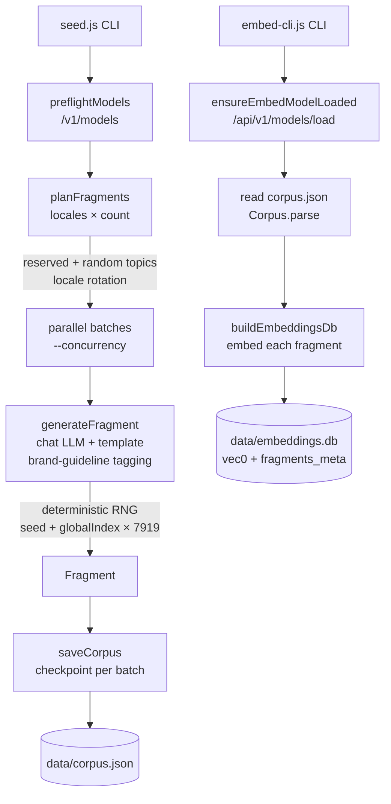

# `@aemdisc/content-seeder`

Deterministic, seedable generator for the AEM Content Discovery corpus. This package is the **sole writer** of
`data/corpus.json` (fragment metadata + body copy) and `data/embeddings.db` (sqlite-vec vector store consumed
read-only by the discovery agent).

Backlinks: [root README](../README.md) · [docs/architecture.md](../docs/architecture.md) · sibling
[`discovery-agent`](../discovery-agent/README.md).

## Two-step workflow

The corpus is built in two explicit steps so an embedding-only re-run (e.g. swapping the embedding model)
does not require regenerating prose.

```bash
# Step 1 — generate corpus.json (LLM prose only; no embeddings by default)
npm run seed -- --seed=20260626 --count=40

# Step 2 — embed corpus.json into embeddings.db
npm run embed
```

`seed.js` defaults `--skip-embeddings` to **true**, so `npm run seed` on its own produces only
`data/corpus.json`. Step 2 (`npm run embed`) is required before the discovery agent can do vector search.

## Architecture



Key behaviours:

- **Topic pools** — `topics.js` defines a **reserved pool** of 6 topics tuned for the demo brief
  (winter / sustainable / women's outerwear) and a **random pool** of 20 broader topics.
  Reserved topics are rotated per locale (`reservedForLocale(localeIndex)`) so the first reserved
  slots differ across `en-gb`, `fr-fr`, `de-de`.
- **Locale rotation** — `planFragments` walks `locales × count` and assigns the first
  `min(count, RESERVED_COUNT)` slots per locale from the rotated reserved pool; the rest come from
  the random pool with round-robin category balancing.
- **Brand-guideline tagging** — `generateFragment` picks 1–3 tags from
  `["sustainability-voice", "premium-tone", "inclusive-language"]` weighted toward 1–2; the same
  pool the discovery agent's brief parser draws from.
- **Deterministic RNG** — Mulberry32 (`rng.js`) is seeded per locale (`seed + localeIndex × 1009`)
  and per fragment (`seed + globalIndex × 7919`). Faker is seeded identically so titles and audiences
  reproduce. Pass `--seed=20260626` to lock the eval corpus.
- **`preflightModels`** — before any LLM call, `preflight.js` queries LM Studio `/v1/models` and
  hard-fails with a clear error if any configured chat model (or the embedding model, when
  `requireEmbed`) is not loaded.
- **Incremental checkpoint** — `saveCorpus(outputPath, fragments)` runs after every batch so a crash
  mid-run still leaves a parseable `corpus.json` with everything generated so far.

## CLI reference

### `npm run seed` — `content-seeder/src/seed.js`

| Flag                | Type   | Default                                      | Notes                                                            |
|---------------------|--------|----------------------------------------------|------------------------------------------------------------------|
| `--output=<path>`   | string | `data/corpus.json`                           | Output file path.                                                |
| `--count=<n>`       | int    | `8`                                          | Fragments per locale, range `1..200`.                            |
| `--locales=<csv>`   | string | `en-gb,fr-fr,de-de`                          | Comma-separated locale codes.                                    |
| `--variation=<lvl>` | enum   | `medium`                                     | One of `low|medium|high` (controls temperature + template pool). |
| `--concurrency=<n>` | int    | `4`                                          | Parallel LLM calls per batch, range `1..16`.                     |
| `--seed=<n>`        | int    | `Date.now() & 0xFFFFFFFF`                    | uint32; lock to `20260626` for the eval corpus.                  |
| `--dry-run`         | flag   | `false`                                      | Generate + log; write nothing to disk.                           |
| `--skip-embeddings` | flag   | **`true`**                                   | Skip the inline embed step; use `npm run embed` separately.      |
| `-h, --help`        | flag   | —                                            | Print help.                                                      |

### `npm run embed` — `content-seeder/src/embed-cli.js`

| Flag              | Type   | Default              | Notes                            |
|-------------------|--------|----------------------|----------------------------------|
| `--corpus=<path>` | string | `data/corpus.json`   | Source corpus to embed.          |
| `--db=<path>`     | string | `data/embeddings.db` | Destination sqlite-vec database. |
| `-h, --help`      | flag   | —                    | Print help.                      |

### `aem-push.js` (library module)

`content-seeder/src/aem-push.js` exports helpers (`pushFragments`, `resetLocales`, `validateCfModel`,
`aemClient`) for pushing the generated corpus into AEM Author via the shared AEM client. It is **not**
wired into the `seed` or `embed` CLIs; consume it programmatically from your own script.

## Input / output

**Inputs**

- CLI flags above.
- A running LM Studio server at `LLM_HOST` (default `http://localhost:1234`) with the chat model
  (and, for `embed`, the embedding model) loaded. Model IDs come from `config/models.json`.

**Outputs**

- `data/corpus.json` — conforms to the `Corpus` Zod schema from `@aemdisc/shared`:
  ```json
  {
    "schemaVersion": "1.0",
    "generatedAt": "<ISO timestamp>",
    "model": "<chat model id>",
    "embeddingModel": "<embedding model id>",
    "fragments": [
      {
        "id": "frag_001",
        "title": "...",
        "category": "product-story | care-guide | seasonal-campaign",
        "targetAudience": "...",
        "brandGuidelinesApplied": ["sustainability-voice", "..."],
        "locale": "en-gb | fr-fr | de-de",
        "lastModified": "<ISO timestamp>",
        "content": "<150–250 word body>",
        "path": "/content/dam/aemcontentdisc/<locale>/<id>"
      }
    ]
  }
  ```
- `data/embeddings.db` — SQLite database with two tables:
  - `fragments_vec` — `vec0(embedding float[<dims>])` virtual table (sqlite-vec).
  - `fragments_meta` — `(rowid, id, locale, category, title)`.
  Dimensions are detected from the first embedding response, so the same DB shape works for any
  embedding model.
- **stdout** — both CLIs print a JSON run-summary on success (paths, seed, totals, durations).

## Usage

```bash
# Locked eval corpus — reproducible across machines
npm run seed -- --seed=20260626 --count=40
npm run embed

# Quick smoke run (no disk writes, no embeddings)
npm run seed -- --count=2 --dry-run

# Single-locale, high-variation regeneration
npm run seed -- --locales=en-gb --count=20 --variation=high --concurrency=2
npm run embed

# Re-embed an existing corpus into a non-default DB path
npm run embed -- --corpus=data/corpus.json --db=data/embeddings.alt.db
```

After step 2 completes, run the [`discovery-agent`](../discovery-agent/README.md) against a brief.
