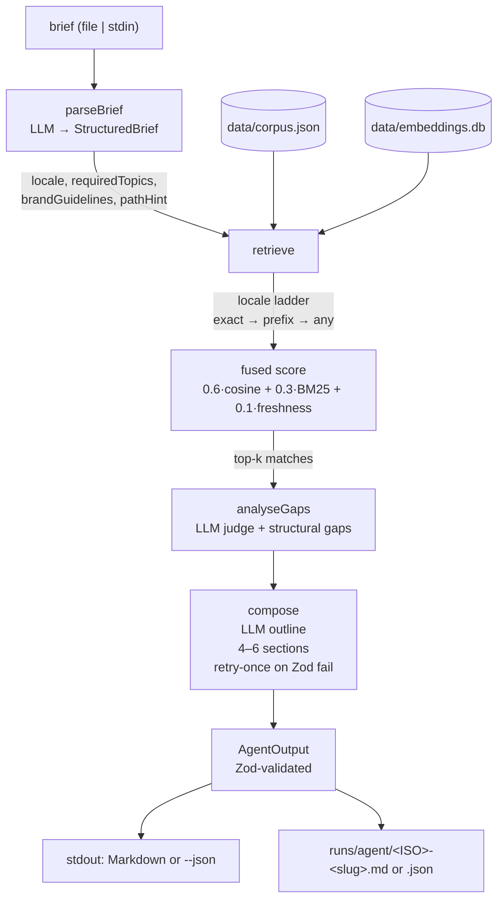

# `@aemdisc/discovery-agent`

Runtime CLI for the AEM Content Discovery Agent. Reads a free-form content brief (file or stdin),
runs a 4-stage LLM + retrieval pipeline against a local fragment corpus, and returns an
`AgentOutput`: the top 0–3 matched fragments, a list of coverage gaps, a draft page outline
(4–6 sections, reuse-or-new), and the full body of each reused fragment as an appendix.

Backlinks: [root README](../README.md) · [docs/architecture.md](../docs/architecture.md) · sibling
[`content-seeder`](../content-seeder/README.md).

## Architecture



Stages live in `discovery-agent/src/pipeline/`:

- **`parseBrief`** — calls the chat LLM to produce a `StructuredBrief`
  (`audience`, `locale`, `tone`, `brandGuidelines`, `requiredTopics`, `pathHint`).
  Brand guidelines are constrained to a locked vocabulary.
- **`retrieve`** — applies the locale ladder (exact → language-prefix → any) over the loaded
  fragments, embeds each `requiredTopic` for cosine search against the sqlite-vec store, runs an
  in-memory BM25 search over the same candidate set, fuses both with a freshness component
  (18-month half-window), and returns the top-k matches plus `nearMisses`,
  `droppedByBrandFilter`, and the `localeRelaxed` flag.
- **`analyseGaps`** — asks the LLM to judge per-topic coverage, then merges in any structural
  gaps (locale relaxation, brand drops).
- **`compose`** — asks the LLM for a 4–6 section outline; validates with the `AgentOutput` Zod
  schema; on validation failure re-prompts **once** with the error before surfacing it.

After a successful run, the rendered output is also persisted to a timestamped artifact in
`runs/agent/` (or the directory passed via `--results-dir`).

## CLI reference — `discovery-agent/src/cli.js`

```
aemdisc-agent [brief.txt] [options]
```

| Flag                  | Type   | Default              | Notes                                                          |
|-----------------------|--------|----------------------|----------------------------------------------------------------|
| `[brief.txt]`         | path   | —                    | Positional brief file. If omitted, stdin is read.              |
| `--json`              | flag   | `false`              | Emit canonical `AgentOutput` JSON instead of Markdown.         |
| `--locale=<code>`     | string | —                    | Override the locale auto-detected from the brief.              |
| `--quiet`             | flag   | `false`              | Suppress pino progress logs on stderr (sets `LOG_LEVEL=silent`). |
| `--top=<n>`           | int    | `3`                  | Debug override of matched-fragments `k`, range `1..10`.        |
| `--source=json\|aem`  | enum   | `json`               | Fragment source: local corpus.json or live AEM Assets HTTP.    |
| `--corpus=<path>`     | string | `data/corpus.json`   | Corpus path when `--source=json`. Resolved against `INIT_CWD`. |
| `--results-dir=<path>`| string | `runs/agent`         | Directory for timestamped result artifacts.                    |
| `-h, --help`          | flag   | —                    | Print help.                                                    |

**Exit codes**

| Code | Meaning                                                           |
|------|-------------------------------------------------------------------|
| `0`  | Success — output written to stdout and persisted to the artifact. |
| `1`  | Pipeline or schema-validation error during a stage.               |
| `2`  | Input error — missing/empty brief, unknown `--source`, or invalid `--top`. |

## Input / output

**Input** — a brief is plain text (Markdown is fine). Either pass a path as the positional
argument or pipe text via stdin. An empty file or empty stdin returns exit code `2`.

**Output** — `AgentOutput` validated by the Zod schema in `@aemdisc/shared/schema/output.js`:

```jsonc
{
  "schemaVersion": "1.0",
  "brief": { /* StructuredBrief: audience, locale, tone, brandGuidelines, requiredTopics, pathHint */ },
  "matchedFragments": [
    { "id": "frag_001", "path": "...", "score": 0.0, "reason": "..." }
    // 0..3 entries
  ],
  "gaps": [
    {
      "topic": "...",
      "coverage": "none | partial",
      "description": "...",
      "partialMatches": ["frag_007"],
      "suggestedAction": "..."
    }
  ],
  "draftOutline": {
    "title": "...",
    "pathHint": "/en-gb/...",
    "sections": [
      // 1..8 sections; the compose prompt asks for 4..6. Each is exactly one of:
      { "heading": "...", "kind": "reuse", "fragmentIds": ["frag_001"], "rationale": "..." },
      { "heading": "...", "kind": "new",   "rationale": "...", "sourcingHint": "..." }
    ]
  },
  "reusedFragments": [ /* full Fragment bodies for every id referenced by a reuse section */ ]
}
```

By default the CLI renders Markdown (see `src/render/markdown.js`); `--json` emits the raw object.
Either way, the same rendered text is also written to
`<resultsDir>/<ISO-timestamp>-<brief-slug>.<md|json>`. The slug is derived from the brief file
name; piped stdin yields `stdin`.

## Usage

```bash
# Markdown rendering (human-readable, default)
npm run agent -- eval/briefs/winter-sustainable.txt

# Canonical AgentOutput JSON
npm run agent -- eval/briefs/winter-sustainable.txt --json

# Pipe a brief via stdin
echo "Audience: UK premium shoppers. Topic: spring linen capsule." | npm run agent

# Override locale and bump the matched-fragment top-k
npm run agent -- eval/briefs/spring-linen-capsule.txt --locale=fr-fr --top=5

# Read from a live AEM Assets endpoint (uses shared AEM client)
npm run agent -- eval/briefs/winter-sustainable.txt --source=aem
```

The default `--source=json` path requires the content-seeder outputs to be present:
`data/corpus.json` and (for vector search) `data/embeddings.db`. See the
[`content-seeder`](../content-seeder/README.md) README for how to generate both.
