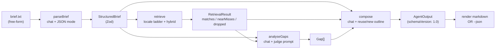

# Architecture

End-to-end walkthrough of the AEM Content Discovery Agent. The agent turns a
free-form content brief into a strict three-block `AgentOutput`
(`matchedFragments`, `gaps`, `draftOutline`) backed by a local content corpus
and a local LLM stack.

## High-level pipeline



Each pipeline stage lives in `discovery-agent/src/pipeline/` and consumes the
schemas exported from `shared/src/schema/`.

## Workspace layout

```
.
├── shared/                       # Cross-package primitives
│   └── src/
│       ├── aem/                  # Sling-POST / Assets API client (read+write)
│       ├── config/               # config/models.json loader
│       ├── llm/                  # LM Studio chat + embed + prompt-log (OpenAI-compatible HTTP)
│       ├── retrieve/             # sqlite-vec store + BM25 index
│       ├── schema/               # Zod schemas (Brief, Corpus, Fragment, Output)
│       └── sources/              # JsonFragmentSource + AemFragmentSource
├── content-seeder/               # `npm run seed` — writes data/corpus.json
│   └── src/                      # generate, topics, templates, aem-push
├── discovery-agent/              # `npm run agent` — CLI + pipeline
│   └── src/
│       ├── cli.js
│       ├── pipeline/             # parseBrief, retrieve, analyseGaps, compose
│       └── render/markdown.js
├── eval/                         # `npm run eval` — F1 harness
│   ├── briefs/                   # 8 hand-written briefs
│   ├── expectations/             # hand-labelled gold matches + gaps
│   ├── run.js
│   └── latest.json
├── config/models.json            # single source of truth for model selection
└── data/
    ├── corpus.json               # canonical content corpus
    └── embeddings.db             # sqlite-vec persisted vectors
```

The three workspaces are wired through npm workspaces (`package.json:workspaces`)
so `shared/` is a true package consumed as `@aemdisc/shared`.

## Pipeline stages

### 1. `parseBrief(rawText) → StructuredBrief`

Source: `discovery-agent/src/pipeline/parseBrief.js`.

- Runs `chat({ system, user, json: true })` against the `parseBrief`-stage model
  resolved via `getChatModel("parseBrief")`.
- The system prompt locks the brand-guidelines vocabulary to a fixed enum so the
  model cannot invent guidelines (see `docs/prompt-log.md`).
- Pre-detects locale from any `/en-gb/`, `/fr-fr/`, `/de-de/` path in the input
  and forces it onto the result; the model's own locale guess is overridden when
  the URL signal is present. Mismatches are appended to `brief.uncertain[]`.
- On `OllamaJsonParseError` or Zod failure, calls once more with the prior error
  message glued onto the system prompt (`retry-once-with-error-hint`). A second
  failure throws and exits the CLI with code `1`.

### 2. `retrieve(brief, { source, k }) → RetrievalResult`

Source: `discovery-agent/src/pipeline/retrieve.js`.

- Loads the candidate fragments from the chosen `FragmentSource`
  (`JsonFragmentSource` reads `data/corpus.json`; `AemFragmentSource` queries
  Adobe Assets API live).
- Applies a **locale ladder**: exact `brief.locale` match first, then the
  language prefix (`en-*` for an `en-gb` brief), then everything else.
  `retrievalResult.localeRelaxed` records which rung was hit; this is what
  `analyseGaps` turns into a structural locale gap.
- For each `brief.requiredTopics[i]`:
  - Embed the topic via `embed(topic)` (only when `--source=json`; the AEM source
    skips vector search and relies on BM25 alone).
  - Run a `sqlite-vec` k-NN search filtered to the locale-allowed ids.
  - Run a `wink-bm25-text-search` query against the same candidate set.
  - Min-max normalise BM25 to [0,1] per query; cosine is already in [0,1].
- Fuse with the locked weights `0.6 · cosine + 0.3 · bm25 + 0.1 · freshness`
  (freshness = `1 − age_months / 18`, clamped to [0,1]).
- Keep each fragment's best per-topic score (max-over-topics).
- Split into `matches` (top-`k`, default 3), `nearMisses` (rest of the survivors),
  and `droppedByBrandFilter` — fragments that scored well but apply none of the
  brief's `brandGuidelines`. Dropped fragments stay reachable to downstream gap
  analysis so the agent can report "candidates existed but were filtered out".

Reasons in `match.reason` are deterministically generated from the score
breakdown (`buildReason()` in `retrieve.js`), not LLM-generated. This keeps the
top block of every output stable and auditable.

### 3. `analyseGaps(brief, retrieval) → Gap[]`

Source: `discovery-agent/src/pipeline/analyseGaps.js`.

Two passes:

1. **LLM judge.** A single chat call asks the model to verdict each
   `requiredTopic` as `none | partial` against the candidate pool
   (`matches ∪ nearMisses ∪ droppedByBrandFilter`). The schema is
   `{ verdicts: TopicVerdict[] }` and the LM Studio chat endpoint is invoked
   in JSON-response mode (`response_format: { type: "json_object" }`).
   Same retry-once-with-error-hint pattern as `parseBrief`. Verdicts are sanitised
   afterwards (`partialMatches` is intersected with the pool; "partial with no
   matches" is rewritten to "none").
2. **Structural gaps.** Deterministically generated and appended without any LLM
   call:
   - `Locale-appropriate content for {locale}` if `retrieval.localeRelaxed` is
     truthy.
   - `Brand guideline coverage: {guideline}` for every required brand voice that
     does not appear in any of the top matches.

`suggestedAction` is templated (`Write a 200-word {locale} {category} fragment …`)
and the category is inferred from keywords in the topic text. This guarantees
every gap has a concrete next step regardless of model quality.

### 4. `compose(brief, retrieval, gaps) → AgentOutput`

Source: `discovery-agent/src/pipeline/compose.js`.

- Builds the user payload from `{ brief, matchedFragments, gaps }` with each
  matched fragment summarised to 200 chars.
- Asks the model for a `DraftOutline` with 4–6 sections, each strictly tagged
  `kind: "reuse"` (with `fragmentIds[]` referencing only matched ids) or
  `kind: "new"` (with `sourcingHint`).
- The Zod schema is wrapped in a `superRefine` that rejects any `reuse` section
  whose `fragmentIds` are not in `matchedFragments` — preventing the model from
  hallucinating fragment ids.
- Retry-once-with-error-hint, identical pattern to the other LLM stages. After
  the second failure, the validation issues are logged and the call throws.
- The final assembly `AgentOutput.parse({ schemaVersion: "1.0", brief,
  matchedFragments, gaps, draftOutline })` is the only authoritative source of
  the agent's output shape.

`pathHint` is overwritten from the brief if the brief provided one, so the
outline always agrees with the brief's URL intent.

## Output contract

`shared/src/schema/output.js`:

```js
AgentOutput = {
  schemaVersion: "1.0",
  brief: StructuredBrief,
  matchedFragments: MatchedFragment[0..3],
  gaps: Gap[],
  draftOutline: {
    title, pathHint, sections: SectionUnion[1..8]
  }
}
```

- `MatchedFragment = { id, path, score in [0,1], reason ≤ 140 chars }`
- `Gap = { topic, coverage: "none" | "partial", description, partialMatches[], suggestedAction }`
- `SectionUnion = ReuseSection | NewSection` (discriminated by `kind`)
  - `ReuseSection = { heading, kind: "reuse", fragmentIds[≥1], rationale }`
  - `NewSection  = { heading, kind: "new",   rationale, sourcingHint }`

Schema files: `shared/src/schema/{brief,corpus,fragment,output}.js`.

## Vector store: `sqlite-vec`

- One file: `data/embeddings.db`, ~3 MB at 72 fragments.
- Schema: a single virtual `vec0` table keyed by fragment id, 768-dim vectors
  matching `embeddinggemma:300m`'s native output.
- `openVectorStore(path)` returns a thin wrapper with `searchByVector(queryVec,
  { k, filterIds })` and `close()`.
- Built once by the seeder (`content-seeder/src/embeddings.js`); the agent only
  reads.

### Why this size, and how it scales

At the current 72-fragment scale, a plain in-memory cosine loop would be faster.
sqlite-vec is chosen for the production story:

- Persistence across runs (the agent does not re-embed on every invocation).
- SQL-inspectable for debugging (`sqlite3 data/embeddings.db`).
- Path-of-least-resistance to ~40k fragments without changing the retrieval API.
- `embeddinggemma`'s **Matryoshka** property means the same vector can be
  truncated to 512/256/128 dimensions when the corpus grows large enough to
  matter. Re-indexing to 256-d at 40k+ fragments cuts the index size by 3× with
  modest recall loss — no need to switch to a different model or store.

For corpora large enough to outgrow sqlite-vec, the same `VectorStore`
interface fits on top of a remote vector database (Qdrant, Vespa) without
changing any pipeline stage.

## LLM stack

- Configured by `config/models.json`. The loader
  (`shared/src/config/models.js`) is referenced by every stage through
  `getChatModel(stage)` / `getEmbeddingModel()`.
- Defaults: chat `google/gemma-4-e4b`, embeddings
  `text-embedding-embeddinggemma-300m`. Both served by a local **LM Studio**
  instance over its OpenAI-compatible HTTP API at `http://localhost:1234`.
  Any model loaded in LM Studio can be swapped in by editing
  `config/models.json` — no rebuild required.
- Per-stage overrides allow swapping a smaller model into `parseBrief` or
  `analyseGaps` without touching code.
- The chat timeout defaults to 120 s and can be raised for slow hardware via
  the `CHAT_TIMEOUT_MS` env var (the full-run script pre-sets 300 000 ms).
  The LM Studio base URL is `OLLAMA_HOST` (env-var name retained from an
  earlier Ollama-backed implementation).
- The eval harness additionally honours an `EVAL_CHAT_MODEL` env var so graders
  on constrained hardware can pick a fallback without editing config.
- `appendPromptLog()` (`shared/src/llm/prompt-log.js`) writes every chat
  request/response pair to the root `prompt-log.md`. This is the runtime log;
  the design log lives in `docs/prompt-log.md`.

## Data flow on `--source=json` (default)

1. `npm run seed` runs the content seeder, which:
   - Plans a deterministic set of topics (`content-seeder/src/topics.js`),
     seeded by `--seed` (default `Date.now() & 0xFFFFFFFF`).
   - Calls the chat model for each fragment body with a category-specific
     template.
   - Writes `data/corpus.json` (schema-validated) and builds `data/embeddings.db`.
   - Optionally pushes the fragments to local AEM (`--aem-push`).
2. `npm run agent eval/briefs/<name>.txt`:
   - Loads `data/corpus.json` via `JsonFragmentSource`.
   - Opens `data/embeddings.db` read-only.
   - Runs the four pipeline stages.
   - Renders Markdown to stdout (or JSON with `--json`).

## Data flow on `--source=aem`

Identical pipeline; only `buildSource(args)` changes. The agent constructs an
`AemFragmentSource` that calls `createAemClient()` (default
`http://localhost:4502`, `admin:admin`) and reads the same fragments live from
the Assets HTTP API. The vector index is skipped in this mode — BM25 alone
drives the retrieval scores because the in-memory corpus has no precomputed
embeddings to look up.

## Production note: Adobe MCP

The seeder writes Content Fragments to local AEM via the Sling POST servlet
because the local AEM SDK does not expose CF CRUD via the AEM MCP server. On
AEMaaCS, the equivalent path is the Adobe-hosted MCP endpoint:

- Server: `mcp.adobeaemcloud.com/adobe/mcp/content`
- Tools: `create_fragment`, `patch_fragment`, etc.

In a Cloud Service deployment the seeder's `aem-push` step would call these MCP
tools through an authenticated MCP client instead of issuing Sling POST
multipart requests. The Zod schemas in `shared/src/schema/` already match the
shape the MCP tools expect, so only the transport layer changes.

## Where to look next

- `docs/sample-run.md` — a real end-to-end run on `winter-sustainable.txt`.
- `docs/prompt-log.md` — every system/user prompt template the agent issues.
- `eval/README.md` — how the F1 harness scores precision/recall/gap-F1.
- `why.md` — the dated decision log behind every non-trivial choice.
